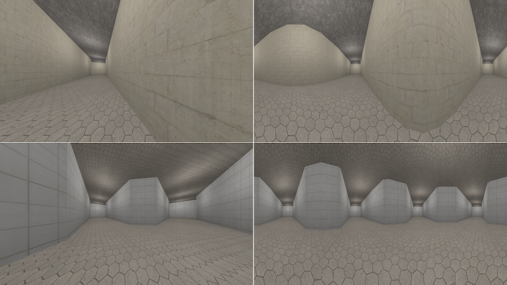
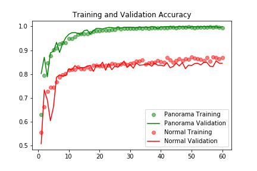

# July Monthly Report - CG Dataset and IntersectNet

### Contents
- [CG Dataset](#CG-Dataset)
- [IntersectNet](#IntersectNet)

### CG Dataset
As there are no datasets of solely corridors and intersections that are labeled accordingly, a blender script is 
created to generate CG renders of corridor samples.
The Script has a list of different centerpieces for the different amount of possible connections to 
adjacent corridors. The scene is deemed a corridor, if it has two or less connections, resulting in a straight 
corridor, a corner, or a dead end. If the centerpiece has three or four connections, it is considered an intersection
. Each intersection option has two different layouts, one with soft, and one with hard corners. Additionally the 
centerpiece is rotated randomly in 90°-steps. The script also uses a list of different Textures for floor, ceiling 
and walls to further randomize the scene.

*Different options for the centerpiece layout*

After the layout is generated, the camera is placed semi randomly:
- for intersections the camera is placed within the intersection at a random rotation angle.
- for corridors the camera is placed either inside the centerpiece or inside an adjacent corridor facing towards the 
intersection with a random variation of ±30°.

*Boundaries of the random camera position*

Finally the script renders normal an panoramic pictures. During renders of the test set both pictures are rendered 
together, so the test dataset contains the same layout in both perspectives.

*Sample of test images: normal perspective on the left, equirectangular perspective on the right; corridor in the top
 row, intersection in the bottom row*

The generated dataset contains 18.000 images, 9.000 images in each perspective (normal and equirectangular). These 
images are split into 5.000 training images, 2.000 validation images, and 2.000 test images. Each split has an equal 
amount of corridor and intersection images. 

### IntersectNet
The network is structured into three convolutional layers, each followed by a pooling layer to abstract the features.
 After the main layers, the network hs a layer to flatten the information. During training a 50% dropout is used to 
 counteract the limited variety of the dataset. Finally, two fully connected layers processes the information and 
 produce the final prediction value.

Two networks are trained, one with the normal perspective images, and one with the equirectangular images. The 
training was conducted for 60 epochs, which took approximately 1h 15min.

*Compared Training Accuracy and Loss*

The final results of both networks are shown below:

| Image Type | Accuracy | Loss   |
|:-----------|---------:|:-------|
| Normal     |   84.2 % | 0.3153 | 
| Panorama   |  100.0 % | 0.0005 |

#### Test with Real Images
To evaluate the ability of the network to distinguish real pictures of corridors and intersections, 30 images, 12 
images of corridors and intersections each, as well as 6 images of locations hard to distinguish (lobby, outdoors, 
and staircase pictures).
However the network only predicts 14 of the 24 labeled pictures correctly (58%). All errors are corridors wrongly 
predicted as intersections, which means 10 of the 12 corridor pictures are predicted wrongly. This means the network 
tends to classify pictures as intersections instead of corridors. The reason for this inaccuracy is hard to judge, 
one possibility is the strong difference between corridors and intersections in the CG dataset, so the network might 
recognize wider corridors or open spaces as intersections as it learned that corridors are as narrow as the CG 
dataset suggests (~2m wide corridors). Another reason might be additional, bright light sources and reflections 
leading the network to assume additional paths, as the corridors in the dataset are only modestly lit.
