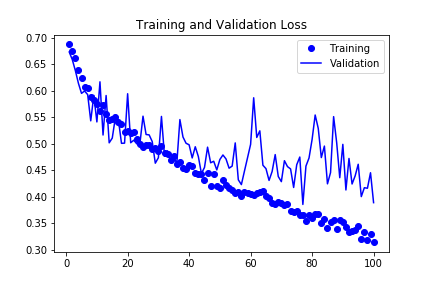
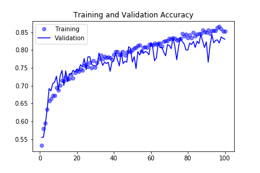

# June Monthly Report - Training a Convnet to Distinguish Cats and Dogs

### Contents
- [Kaggle Dogs vs. Cats Dataset](#Kaggle-Dogs-vs.-Cats-Dataset)
    - [Data Preprocessing and Augmentation](#Data-Preprocessing-and-Augmentation)
- [Network Structure and Training](#Network-Structure-and-Training)

### Kaggle Dogs vs. Cats Dataset
The Dogs vs. Cats dataset is provided by Kaggle.com as part of a computervision challenge in 2013. It consists of 
25000 images, 12500 of each dogs and cats. To speed up training and test image augmentation methods, the dataset is 
reduced to 2000 training images, and 1000 images each for validation and testing.

#### Data Preprocessing and Augmentation
For preprocessing, the  jpge pictures are decoded into a pixel grid for each color channel resulting in a tensor of 
the picture dimensions times the 3 color channels (150 x 150 x 3). After it the tensor is normalized from  pixel values
 in [0, 255] to [0, 1]. To prevent the strain of loading all available pictures, a generator is created that streams 
 preprocessed pictures and their binary label from the directory as needed in batches of 20 tensors at a time.
 To increase the variety of the limited dataset, the data is augmented by performing several random operations on the 
 image before preprocessing:
 - a rotation between 0° and 40°
 - a shift between 0.0 and 0.2 of the original width/height in either direction
 - a shear transformation with a coefficient between 0.0 and 0.2
 - a zoom of the picture by a factor between 0.0 and 0.2
 - flipping the image along the vertical axis
 
 Any newly created pixels pixels with unknown values during processes like rotations and shifts are filled with the 
 values of their nearest neighbors.
 
 ### Network Structure and Training
 The planned network is structured to contain four convolutional layers, each followed by a pooling layer to abstract
  and downsample the representation and avoid overfitting. Additionally after the covolutional layers there is a 
  layer to flatten the representation and randomly drop out 50% during training to further avoid overfitting.
 Finally there is a fully connected (dense) layer for the classification, as well as a final fully connected layer to
  reduce the features to a single prediction value.
The Network was then trained on the augmented and preprocessed images for 100 epochs and achieved a final accuracy on
 the test images of 81%.

While 81-82% accuracy is not the best possible result, the network shows that training a network on a small 
but augmented dataset still shows an increase in accuracy of about 15% relative to a network trained without augmenting 
the dataset. Without increasing the dataset size the accuracy is likely limited to 86-87% according to [Deep Learning
 with Python by F. Chollet].