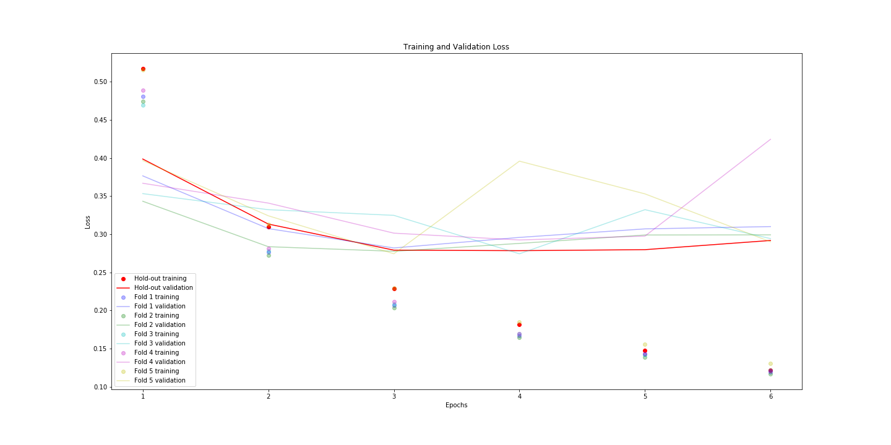
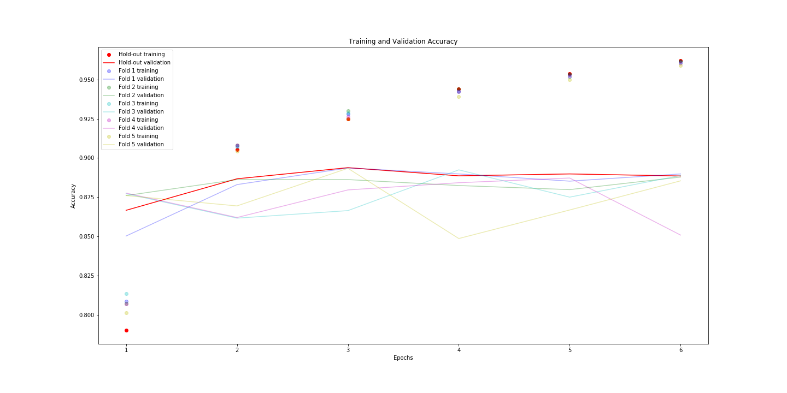
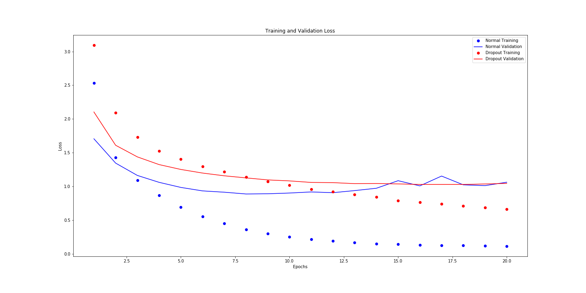
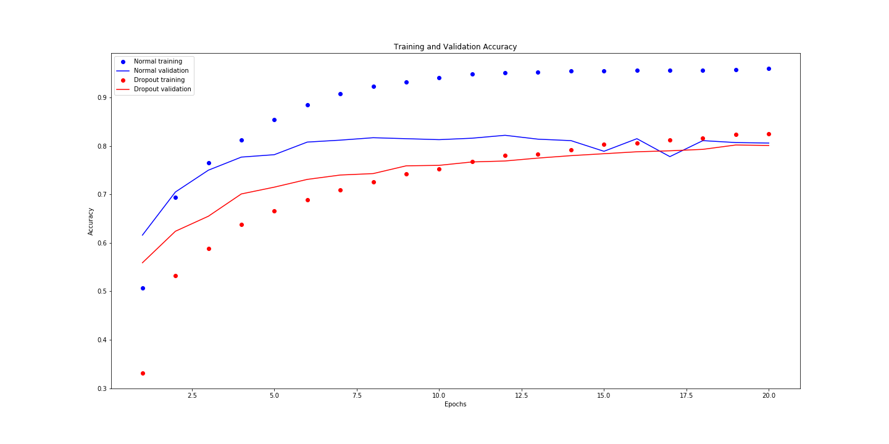

# June Monthly Report - Deep Learning Tutorials

### Contents
- [Workstation Setup](#Workstation-Setup)
- [Tutorial Projects](#Tutorial-Projects)
    - [Classification of Movie Reviews](#Classification-of-Movie-Reviews)
    - [Classification of Newswire Topics](#Classification-of-Newswire-Topics)

### Workstation Setup
The laptop workstation runs keras 2.2.4 with tensorflow 1.6.0 as backend. The laptop only supports CPU training as it
 is equipped with an AMD Radeon R7 M360 and an OpenCL compatible keras backend for AMD graphics cards could not be 
 found and implemented. Therefore the laptop workstation ist restricted to CPU training. Due to this limitation it is
 only used sparingly in training of the initial tutorial projects, as well as analysis and visualization of training 
 results.

The desktop workstation runs keras 2.2.4 too. However it uses the tensorflow 1.13.1 GPU build as backend. The Desktop
 fully supports GPU enhanced training, as it is equipped with an NVIDIA Quadro K620 graphics card. Because of the GPU
 enhanced training, it is used to train the tutorial projects so far.

Once the computer vision based tutorials are started the comparatively weak NVIDIA Quadro K620 may be too slow to train
 the networks in a short time. In this case the GPU Workstation will be used, which is equipped with two NVIDIA GeForce
 RTX 2080Ti graphics cards, which should cut down training time enormously.   

### Tutorial Projects
#### Classification of Movie Reviews
This introductory project uses a binary classification network to decide whether a movie review is positive or negative.
The Dataset consists of 50.000 reviews which have been reduced to the 10.000 most used words in the dataset. The
 dataset is divided equally into test and training subsets (25.000 reviews in each subset).
The project is also used to compare hold-out validation to k-fold cross-validation. Therefore the training data is
 split into a training set and a validation set in two different ways.
For hold-out validation, the training data is split into 10.000 reviews for validation and 20.000 reviews for training.
For k-fold cross-validation, the training data is split into 5 sets of 5.000 reviews each. Then 5 identical models
 of the network are trained with a different split as validation data and the 4 remaining splits as training data as
 pictured in the table below:

| Model |   Split 1    |   Split 2    |   Split 3    |   Split 4    |   Split 5    |
|:-----:|:------------:|:------------:|:------------:|:------------:|:------------:|
|   1   |**Validation**|  *Training*  |  *Training*  |  *Training*  |  *Training*  |
|   2   |  *Training*  |**Validation**|  *Training*  |  *Training*  |  *Training*  |
|   3   |  *Training*  |  *Training*  |**Validation**|  *Training*  |  *Training*  |
|   4   |  *Training*  |  *Training*  |  *Training*  |**Validation**|  *Training*  |
|   5   |  *Training*  |  *Training*  |  *Training*  |  *Training*  |**Validation**|

The network model consists of three layers:
1. a fully connected layer with 16 units and a RELU activation function
2. another fully connected layer with 16 units and a RELU activation function
3. an output layer with one unit and sigmoid activation function

The optimisation  is RMSprop with a learning rate of 0.001 and the loss function is binary cross-entropy.
The networks are then initially trained for 20 epochs and after optimisation for 6 epochs.

After training the k-fold validation scores are averaged and compared to the validation score of the hold-out validation.

|  Model  | Hold-out |  K-Fold  |
|:-------:|:---------|:---------|
| HO-1    |  0,8770  |          |
| KF-1    |          |  0,8772  |
| KF-2    |          |  0,8758  |
| KF-3    |          |  0,8740  |
| KF-4    |          |  0,8345  |
| KF-5    |          |  0,8792  |
|**Total**|**0,8770**|**0,8682**|

Additionally the loss and accuracy are plotted over the training process.

The k-fold cross-validation approach performs on average very similar to the hold-out validation model. However, as it
 is training multiple networks, training takes significantly longer. Due to this, hold-out validation is recommended
 when a big dataset is available. With a limited dataset the k-fold cross-validation produces a more stable result as it
 is forming the average of several networks that are trained on different variations of the same data.
 
#### Classification of Newswire Topics
This introductory project uses a multiclass classification network to decide the topic of a newswire article.
This dataset consists of 11.228 newswire articles (reduced to the 10.000 most occurring words), organized into 46
 mutually exclusive topics.
The dataset is divided equally into test and training subsets (5.614 articles each).
The project is also used to compare networks using a 50% dropout after each layer, with networks without any dropout.

The dropout model consists of three layers with a dropout after each layer:
1. a fully connected layer with 64 units and a RELU activation function
    1.1. 50% Dropout, drops half of the values in the output and rescales the remaining values by 2
2. another fully connected layer with 64 units and a RELU activation function
    2.1. 50% Dropout, drops half of the values in the output and rescales the remaining values by 2
3. an output layer with 46 units and softmax activation

The optimisation is RMSprop with a learning rate of 0.001 and the loss function is categorical cross-entropy.
Both networks are trained for 20 epochs.

After training, the networks the show simillar validation scores:

|       | With Dropout | Without Dropout |
|------:|:-------------|:----------------|
| Score | 0.7707       | 0.7791          |

Additionally the loss and accuracy are plotted over the training process

While the network without dropout arrives at an optimal loss and accuracy faster, needing less epochs, the network with
 dropout need a longer training time but is very resistant to overfitting. While the training loss and accuracy scores
 of the dropout model is well below the normal models scores, the validation scores are very close after just a few
 more epochs.