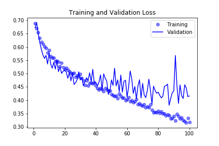
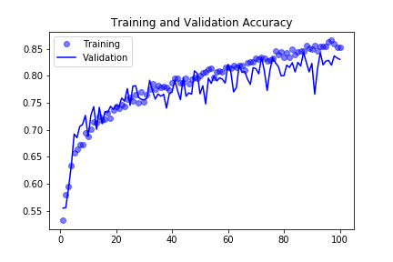

# Weekly Report 14 (07.15. ~ 07.19.)

## Overview
- [Training a Convnet from Scratch on a Small Dataset](#Training-a-Convnet-from-Scratch-on-a-Small-Dataset)
- [Plans for Week 15](#Plans-for-Week-15)

## Training a Convnet from Scratch on a Small Dataset
- Test Set Accuracy: 81.2%

## Plans for Week 15
- setup conda environment on GPU workstation
- start on the dataset for intersectNet
