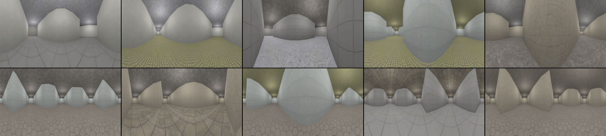

# Weekly Report 17 (08.05. ~ 08.09.)

## Overview
- [CG Dataset Generation](#CG-Dataset-Generation)
- [CG Render Samples](#CG-Render-Samples)
- [Plans for Week 18](#Plans-for-Week-18)

## CG Dataset Generation
- updated rendering script with camera and light placement
    - Lights positioned every 3m along the corridor
    - Camera positioned in 2 areas:

- Soft and sharp edges for intersections with 3 and 4 corridors:

    - rotated randomly in 90° steps

## CG Render Samples
Corridor Samples

Intersection Samples

## Plans for Week 18
- if necessary improve CG quality by:
    - find and add ceiling textures (currently reusing floor textures)
    - add random variation to lighting
    - improving corridor detail/complexity
    - modeling light fixtures for lights
- start building the network