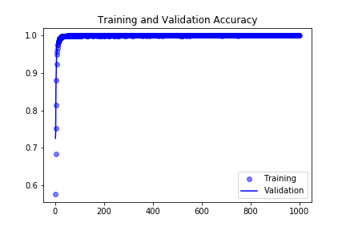
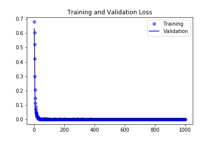

# Weekly Report 19 (08.19. ~ 08.23.)

## Overview
- [Network Structure](#Network-Structure)
- [Network Training](#Network-Training)
- [Plans for Week 20](#Plans-for-Week-20)

## Network Structure

| Layer (type)                  | Output Shape        | Param #  |   
|:------------------------------|:--------------------|---------:|
|conv2d_1 (Conv2D)              | (None, 148, 82, 96) |     2688 |
|max_pooling2d_1 (MaxPooling2D) | (None, 74, 41, 96)  |        0 |
|conv2d_2 (Conv2D)              | (None, 72, 39, 384) |   332160 | 
|max_pooling2d_2 (MaxPooling2D) | (None, 36, 19, 384) |        0 | 
|conv2d_3 (Conv2D)              | (None, 34, 17, 512) |  1769984 | 
|max_pooling2d_3 (MaxPooling2D) | (None, 17, 8, 512)  |        0 | 
|flatten_1 (Flatten)            | (None, 69632)       |        0 | 
|dropout_1 (Dropout)            | (None, 69632)       |        0 | 
|dense_1 (Dense)                | (None, 512)         | 35652096 | 
|dense_2 (Dense)                | (None, 1)           |      513 | 

- Total params: 37,757,441
- Trainable params: 37,757,441
- Non-trainable params: 0

## Network Training
- First attempt at full image resolution (960x540) took >40h and produced a network too big to load in jupyter notebook (0.9GB)
- Second attempt at greatly reduced resolution (150x84) took 21:53:38 to train

- currently same structure with 200 epochs in training (estimated training time 4.4h)

## Plans for Week 20
- review network structure and refine training