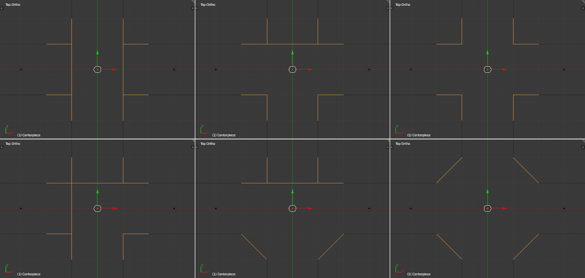

# Weekly Report 20 (08.26. ~ 08.30.)

## Overview
- [Changes to Image Generation](#Changes-to-Image-Generation)
- [Network Training](#Network-Training)
- [Plans for Week 21](#Plans-for-Week-21)

## Changes to Image Generation
- added scripts to generate normal images
    - modified camera spawning parameters:
        - shrinked corridor spawning area to prevent normal camera clipping trough wall (still possible in some configurations)
        - changed random rotation in corridor to always face towards intersection ±30°
- added corner to corridor options and changed intersection layouts to dead ends for non-connecting corridors

- changed script for test images to render the same corridors for normal and panoramic pictures

## Network Training
- trained 2 comparative networks for 200, then 60 epochs

- Test Set Accuracy (60 epoch network):
  - Normal:     85.60% (Loss: 0.3200)
  - Panorama:   99.69% (Loss: 0.0083)

## Plans for Week 21
- Write Project Report