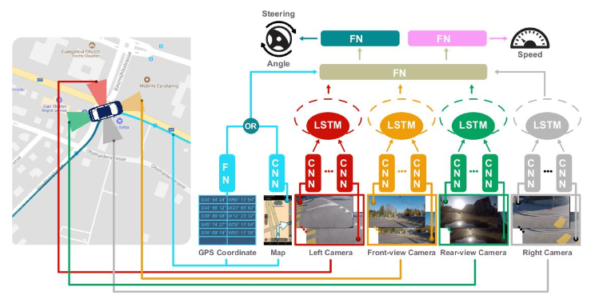

# [End-to-End Learning of Driving Models with Surround-View Cameras and Route Planners](https://arxiv.org/abs/1803.10158)
*by S. Hecker, D. Dai, and L. Van Gool*

- Information from all around the vehicle needs to be gathered and integrated to make safe decisions.
- Human drivers us virtual extensions to their limited field of view (side- & rear-view mirrors) and their mental or digital map to make decisions and select a route to their destination.
    - Therefore, mobile robots and autonomous driving need similar systems to support the decision and route planning process.
- Single front-view camera inadequate to learn a safe driving model
- Surround-view camera system, and planned driving route for training,
    - human driver maneuvers as ground-truth.
    - learning task similar to a human apprentice
- End-to-end learning of the driving model: map inputs from surround-view and route planner directly to low-level driving maneuvers
    - tracking for traffic agents & control devices deferred to future work

##### Driving Models for Automated Cars:
1. Mediated Perception
    - recognition of all driving relevant objects (lanes, traffic signs, traffic lights, cars, pedestrians, etc.)
    - realized by diverse sensors (i.e. cameras, laser sensors, radar, GPS and HD maps)
    - current state-of-the-art for autonomous driving
2. End-to-End Mapping
    - direct mapping from ssensory input to maneuvers
        - 1980s: neural network to learn direct mapping from images to steering angle

- Driving Scene Understanding
    - detection and tracking of moving objects elaborated in other sources (72, 44, 55, 39, 61)

##### Sensors used:
- Cameras
    - double coverage of surround view
    - 4 cameras mounted in 90 deg angles (0, 90, 180, 270)
    - 4 cameras mounted in 45 deg to the first set (45, 135, 225, 315)
- Route Planners
    - not much attention to integration of route planners with autonomous drive learning
    - OpenStreetMaps geodata used for route planning (and TomTom Map, albeit not public => workaround screen capture off iPhone 7)
    - past driving  trajectories (stack of GPS coordinates) and GPS tags of the next 300 meters ahead taken as representation of planned route and current position
- Human Driving Input
    - steering wheel angle, vehicle speed via CAN bus
    - odometry via cameras (GoPro) GPS and IMU module

##### Driving Model Learning Task:
![F: (S_[t−k+1, t], V_[t−k+1, t], L_[t−k+1, t], I_[t−k+1, t], P_[t]) → S_[t+1] × V_[t+1]](./img/EndToEndLearningOfDrivingModels_LearningTask.png "Learning Task")
- S: Vehicle's Steering angle
- V: Vehicle's Velocity
- L: Vehicle's Location
- I: Surround-View Video
- P: Planned Route
- discrete time at sampling rate f => decisions every 1/f seconds
    - t indicates the timestamp
    - t-k is the k. previous sample point => the k recent samples are [t-k+1, t]

- learns from multiple previous frames in order to better understand traffic dynamics

##### Driving Model loss Function:
)+λl(V^n_[t+1],F_v(S^n_[t−k+1, t],V^n_[t−k+1, t],L^n_[t−k+1, t],I^n_[t−k+1, t],P_t)))](./img/EndToEndLearningOfDrivingModels_LossFunction.png "Loss Function")
- λ: Parameter to balance the losses (=1 in this work)
- l(...): L2 loss function for continuous regression

- System trained with only 4/8 Cameras (0, 90, 180, 270)
    - data recorded with all 8 to keep flexibility for future work

##### Neural Network Layout:

- multiple Convolutional Neural Networks (CNN) as Feature Encoders
    - ResNet34 model, pre-trained on the ImageNet dataset
- 4 Long Short-Term Memories (LSTM) as temporal encoders for information from the surround-view cameras
- a Fully-connected Network (FN) to fuse information from the cameras and the map
- 2 Fully-connected Networks (FN) to output future speed and steering angle

##### Training:
- 80/20 training/testing (24/30 driving routes for training)
- synchronized video at 10 fps (60fps generated very large dataset)
- synchronized sample:
    - 4 frames at 256x256 (front, left, right, back)
    - 256x256 rendered image for TomTom route planner **OR** 300x2 Matrix for OSM route planner
    - CAN bus data
    - GPS data of the *'past'*
- Adam Optimizer
    - initial learning rate: 10^-4
    - batch size: 16 for 5 epochs
        
    => training time ~3 days
- Surround-view camera training
    - 4 frames (t-0.9s, t-0.6s, t-0.3s, t) => frequency = 3.33
        
    => 4x4 = 16 CNNs for capturing street-view scene

##### Results
- Mean Square Error (MSE) for comparison
    - state-of-the art compared to similar models
    - speed and steering angle prediction 0.3s into the future easy for network, as inputs usually don't change faster than the prediction range

- in truly autonomous vehicles the past driving states may not always be correct,
    - policy to rely on past *'ground-truth'* states should be used with caution
    - else errors may be exaggerated via a feedback loop
    
    => S_[t-k+1, t] and V_[t-k+1, t] removed (no previous human driving maneuvers available)
    - force the network to learn based on knowledge from route planners and road situations

- visual evaluation of the planned route (TomTom) better results than plain GPS coordinates (OSM)
    - improvement in steering angles
    - GPS locations lack high-level & contextual information (distinguishing between *'highway exit'* and *'slight right bend'*)

- surround-view cameras reduce overall speed prediction, **but** are especially useful on roads without traffic control lights or signs
    - can see approaching entities, while front-only camera cars are blind in many directions
    - more precise understanding of the surroundings

**Potential Further Readings:**
- (2018) ***End-to-end driving via conditional imitation learning***. Codevilla, Mueller, Lopez, Koltun, Dosovitskiy
- (2018) ***Event-based vision meets deep learning on steering prediction for self-driving cars***. Maqueda, Loquercio, Gallego, Garcia, Scaramuzza

- (2017) ***Explaining how a deep neural network trained with end-to-end learning steers a car***. Bojarski, Yeres, Choromanska, Choromanski, Firner, Jackel, Muller
- (2017) ***Simultaneous perception and pathgeneration using fully convolutional neural networks***. Caltagirone, Bellone, Svensson, Wahde
- (2017) ***Computer vision for autonomous vehicles: Problems, datasets and state-of-the-art***. Janai, Gueney, Behl, Geiger
- (2017) ***Pathtrack: Fast trajectory annotation with path supervision***. Manen, Gygli, Dai, Van Gool
- (2017) ***Combining neural networks and treesearch for task and motion planning in challenging environments***. Paxton, Raman, Hager, Kobilarov
- (2017) ***Perception, Planning, Control, and Coordination for Autonomous Vehicles***. Pendleton, Andersen, Du, Shen, Meghjani, Eng, Rus, Ang

- (2016) ***Surround vehicles trajectory analysis with recurrent neural networks***. Khosroshahi, Ohn-Bar, Trivedi
- (2016) ***Trajectories and maneuvers of surrounding vehicles with panoramic camera arrays***. Dueholm, Kristoffersen, Satzoda, Moeslund, Trivedi

- (2015) ***Toward personalized, context-aware routing***. Yang, Guo, Ma, Jensen

- (2014) ***3d traffic scene understanding from movable platforms***. Geiger, Lauer, Wojek, Stiller, Urtasun

- (2012) ***Autonomous ground vehicles—concepts and a path to the future***. Luettel, Himmelsbach, Wuensche

- (2011) ***Towards fully autonomous driving: Systems and algorithms***. Levinson, Askeland, Becker, Dolson, Held, Kammel, Kolter, Langer, Pink, Pratt, Sokolsky, Stanek, Stavens, Teichman, Werling, Thrun

- (1948) ***Cognitive maps in rats and men***. Tolman
