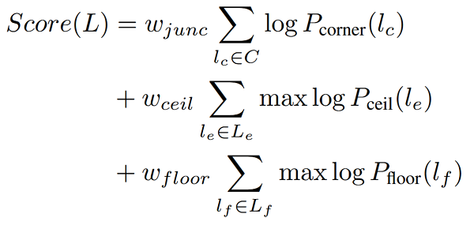

# [LayoutNet: Reconstructing the 3D Room Layout from a Single RGB Image](https://arxiv.org/abs/1803.08999)
*by C. Zou, A. Colburn,Q. Shan, and D. Hoiem*

##### Introduction
- Layout representable as a set of projected corner positions/boundaries (3D Mesh)
- among the best for perspective images (panoramic) and comparable in speed
- 3 step approach
    1. analyzing vanishing points & alignment w/ floor (wall-wall-boundaries become vertical lines)
    2. corner (layout junctions) and boundary probability map predicted directly on image (CNN w/ encoder-decoder structure)
    3. 3D layout parameters are optimized to fit predicted corners and boundaries

##### Panoramic image alignment
- estimating floor plane under spherical projection
- reprojection into 2D equirectangular
- detection of long line segments in overlapped perspective view
- vote for three mutually orthogonal vanishing directions

##### Network structure
- Deep panorama encoder
    - 6-channel feature map (concatenation of single RGB 512x1024 panorama image)
    - Manhattan line feature map
- 2D layout decoder
    - 2D feature map
        - boundary prediction through 7 layers of nearest neighbor up-sampling
    - 2D corner map
- 3D layout regressor
    - 2D corners & boundaries → 3D layout parameters mapping mathematically simple but difficult to learn
    - regressor to produce better corners & boundaries
    - 6 parameters (ground plane aligned to x-z-axis):
        - s_w: width
        - s_l: length
        - s_h: height
        - T = (t_x, t_z): translation
        - r_0: rotation on x-z-plane
- loss function
    
    - m_e: layout boundary map
    - m_c: layout corner map
    - d = {s_w, s_l, s_h, t_x, t_z, r0}: feature vector
    - p: pixel probability in m_e
    - q: pixel probability in m_c
    - ^: respective ground truth
    - n:number of pixels (resolution)
    - α, ß, γ: weights for each loss term (here: α = ß = 1 & γ = 0.01)

##### Training details
- each network trained separately
- ground truth smoothing
    - 2D boundary and corner map is binary with thin point/curve → difficult training, huge penalty for small deviances
    - dilute ground truth map with factor 4 and smooth with Gaussian kernel 20x20
- augment training samples by horizontal rotation (0°-360°), left-right flipping, luminance change (0.5-2), and ±10° rotation on image plane for perspective images

##### 3D layout optimization
- top corners always above bottom ones (vertical walls only / no slanted walls)
- bottom corners on same ground plane (level floor / no different levels in room)
- intersecting walls always perpendicular (manhattan layout / cuboid or L-shaped room)
- columns of panorama correspond to rotation angle of camera
- score function for 3D layout
    
    - L: candidate (cardinality = #walls×2)
    - C: 2D projected corner positions of L
    - L_e: set of projected wall-ceiling boundaries (connect nearby corners)(cardinality = #walls)
    - L_f: set of projected wall-floor boundaries (connect nearby corners)(cardinality = #walls)
    - P_corner: pixel-wise probability value on m_c (layout corner map)
    - P_ceil: pixel-wise probability value on m_e (layout boundary map)
    - P_floor: pixel-wise probability value on m_e (layout boundary map)
    - w_junc, w_ceil, w_floor: term weights (= 1.0, 0.5, 1.0 → set using grid search)
- sample candidate layouts by shifting one of the wall position within ±10%
- ~1000 layout candidates are sampled
- less than 30 s per image and better 3D layouts produced

##### Extensions
- General Manhattan layouts
    - include training examples with more than 4 walls visible (~10% of examples)
    - determine wall generation by score threshold (network generates 4 walls unless there is evidence for more)
- Perspective images
    - skip alignment and optimization steps → directly predict corners & boundaries

##### Evaluation of Cuboid layout for panorama
1. 3D IoU (intersection over union) between predicted 3D layout and ground truth, averaged across all images
2. Corner error; distance between predicted corner and ground truth, normalized by image diagonal and averaged across all images
3. Pixel wise accuracy between layout and ground truth, averaged across all images

- performs better or equal to existing models

##### Non-cuboid layout for panorama

- only small dataset (→ imperfect corner/boundary detection)
- network able to predicts complex layout

##### Conclusion
- LayoutNet relaxes commonly assumed cuboid layout
- pre-aligning based on vanishing points and Manhattan constraints improve quantitative results
