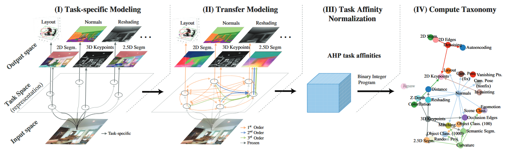
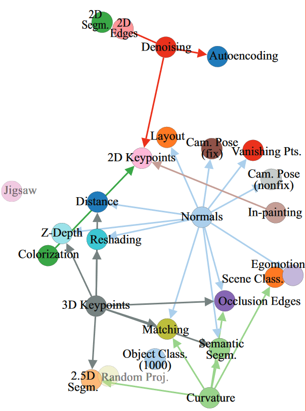

# [Taskonomy: Disentangling Task Transfer Learning](https://arxiv.org/abs/1804.08328)
*by A. Zamir, A. Sax, W. Shen, L. Guibas, J. Malik, and S. Savarese*

##### Introduction
- finding complex f: X→Y, when many x∈X, y∈Y are given as training data in fully supervised learning is usally very successful
- isolated training of tasks or comprehensive perception system often a lot of minute work, as every task has to be learned individually
    - this ignores their relationships and leads to massive labeled data requirements
    - model aware of the relationships demands less supervision, less computation, and it behaves in more predictable ways
    - relationships are non-trivial and complicated to find
- feed-forward network, each layer successively forms more abstract representations of the input, containing the information for mapping the input to the output
    - representations can be useful for multiple outputs (tasks) if tasks are related
    
=> affinity matrix among tasks based on ability to be derived from representation of different task
- solving tasks  with far less data compared to individual training
    - avoids imposing prior assumptions on task space

##### Related Work
- structure among learning tasks useful for multiple fields of application
    - *Self-supervised learning* leverages inherent relationships to learn an expensive task from a cheap surrogate (e.g. objet detection from colorization)
        - Taskonomy approach can discover obscure relationships in a large space of tasks
    - *Meta-learning* is similar to Taskonomy approach as it seeks to also find a computational meta-structure of the space of tasks
    - *Learning Theory* uses many existing learning structures to provide generalization guarantees
        - various approaches:
            - modeling transferability by mapping a hypothesis for one task onto a hypothesis for another
            - information-based transferability
            - modeling inductive bias
        - either reliant on intractable computations or restricted model/task

##### Method
- maximize collective performance on a set of tasks
- V = T∪S: task dictionary
    - T = {t_1,...,t_n}: set of tasks targeted to be solved
    - S = {s_1,...,s_m}: set of tasks that can be trained (source)
    - T - (T∩S): tasks wanted to be solved but unable to train (target-only)
- task taxonomy is a computationally found, directed hypergraph that captures task transferability over any given task dictionary
    - edges represent feasible transfer case with it's weight being the prediction of it's performance
- graph is used to estimate optimal transfer policy
- staged approach:
    
    1. task-specific network for each task in S is trained
    2. feasible transfers are trained, including higher-order transfers (multiple input tasks to one target)
        - source should have sufficient information for solving target task, and have the information accessible (easily extractable)
        - sampling procedure for filtering out higher-order transfers that are less likely to yield good results
    3. affinities from transfer function performances are normalized
    4. synthesizing hypergraph, which can predict the performance of transfer policies and optimize for the best solution

##### Experiments
- Network Architacture as homogeneously as possible to avoid injecting bias
    - Encoder: fully convolutional ResNet-50 without pooling
    - Transfer Functions: shallow networks wiht 2 convolutional layers
    - Decoder: 
        - pixel-to-pixel: 15-layer fully convolutional network
        - low dimensional tasks: 2-3 fully connected layers
- all networks trained with the same hyperparameters

##### Results

- Networks are well trained and show stable results
- in general, performing on par or better than state-of-the-art networks (no formal benchmark)
